<!--
  DANISH.OS v1.3 — a living developer system.
  Built as a small product, not a badge wall. Everything is real or a
  clearly-marked placeholder. Edit profile-data.yml and run
  scripts/generate_profile_assets.py to refresh the dynamic parts;
  keep the START / END marker comments intact.
  psst — there's a root-access console further down. The password is
  obviously not a real password. Or is it? (it isn't.)
-->

<div align="center">



<p>
  <a href="https://www.linkedin.com/in/danish5/"><b>LinkedIn</b></a>
  &nbsp;&#183;&nbsp;
  <a href="https://medium.com/@danish_muhd/"><b>Writing</b></a>
  &nbsp;&#183;&nbsp;
  <a href="https://github.com/danish-kv?tab=repositories"><b>Repositories</b></a>
</p>

<samp>
  <a href="#system-manifest">manifest</a> &#183;
  <a href="#architecture-flow">architecture</a> &#183;
  <a href="#active-processes">processes</a> &#183;
  <a href="#deployment-pipeline">pipeline</a> &#183;
  <a href="#repository-galaxy">galaxy</a> &#183;
  <a href="#engineering-principles">principles</a> &#183;
  <a href="#latest-writing">writing</a> &#183;
  <a href="#telemetry">telemetry</a> &#183;
  <a href="#developer-console">console</a> &#183;
  <a href="#root-access">root</a> &#183;
  <a href="#connection-port">connect</a>
</samp>

<br><br>



</div>

---

## System Manifest

<samp>~/danish.os &#8250; read manifest</samp>

I build full-stack systems, and I care about the parts most profiles skip — the
API contract, the migration, the deploy, the failure state. A screen is easy to
demo. A system has to keep working after the demo is over. That's the part I
actually enjoy.

|  |  |
|--|--|
| **What I build** | Web applications end to end — React interfaces over Django / DRF and FastAPI services, backed by PostgreSQL or MongoDB, shipped in containers. |
| **How I think** | In systems and contracts. I want to see the whole path a request takes before I trust any single piece of it. |
| **What's different** | Deployment, data integrity, and failure handling are part of my build — not something to hand off afterwards. |
| **Where I'm based** | India, working across the stack and the time zones it touches. |

---

## Architecture Flow

<samp>~/danish.os &#8250; trace request --follow</samp>

Watch one request make the whole trip — interface to data and back, with the
platform it all runs on underneath. Then open any layer for the full toolset.



<details>
<summary><b>&#9656; Inspect Interface Layer</b> — what people see and touch</summary>

| Tool | Role |
|------|------|
| React | Component-driven UIs |
| JavaScript | The language the client speaks |
| Redux | Predictable shared state |
| Tailwind CSS | Utility-first styling |
| ShadCN | Accessible component primitives |
| Framer Motion | Motion and micro-interactions |
| Figma | Design before build |

</details>

<details>
<summary><b>&#9656; Inspect API Layer</b> — contracts between systems</summary>

| Tool | Role |
|------|------|
| Python | Primary backend language |
| Django | Batteries-included application framework |
| Django REST Framework | Structured, versioned REST APIs |
| FastAPI | Typed, high-throughput services |
| WebSockets | Realtime, bidirectional channels |

</details>

<details>
<summary><b>&#9656; Inspect Data Layer</b> — persistence and integrity</summary>

| Tool | Role |
|------|------|
| PostgreSQL | Relational source of truth |
| MongoDB | Document data where it fits |
| Django ORM | Models, migrations, query safety |
| Database design | Schemas that stay correct under load |

</details>

<details>
<summary><b>&#9656; Inspect Infrastructure Layer</b> — ship, run, observe</summary>

| Tool | Role |
|------|------|
| AWS | Cloud hosting and services |
| Docker | Reproducible environments |
| Kubernetes | Orchestration at scale |
| Git | Version control and CI triggers |
| System design | How the pieces fit and fail |

</details>

---

## Active Processes

<samp>~/danish.os &#8250; process.list --running</samp>

| PID | Process | State |
|----:|---------|-------|
| 001 | <!-- CURRENT-BUILD -->A full-stack operations tool — FastAPI services with a React front end<!-- /CURRENT-BUILD --> | `running` |
| 002 | <!-- CURRENT-LEARN -->Deeper system design, API contracts, and scaling data<!-- /CURRENT-LEARN --> | `running` |
| 003 | <!-- CURRENT-FOCUS -->Reliable APIs, deployment systems, and product engineering<!-- /CURRENT-FOCUS --> | `running` |

<sub>These lines are driven by <code>profile-data.yml</code> — edit the file, not the table.</sub>

---

## Deployment Pipeline

<samp>~/danish.os &#8250; watch pipeline</samp>



How I ship, in three sentences: small changes, merged often, deployed the same
way every time. The pipeline is code too — versioned, reviewed, and boring on
purpose. If a failure can happen, I'd rather it happen loudly in CI than
quietly in production.

---

## Repository Galaxy

<samp>~/danish.os &#8250; scan orbit</samp>



> **Placeholder satellites** — real repositories dock here via
> `featured_projects` in `profile-data.yml`. The build logs below follow the
> same rule: structure now, real names and results when they're true.

<details>
<summary><b>&#9656; Open build.log[01]</b> — Realtime operations dashboard <em>(replace)</em></summary>

- **Problem** — Teams were tracking work across spreadsheets and messages, with no single source of truth.
- **Approach** — A service-backed dashboard with WebSocket updates and an append-only activity log, so every change has an actor and a timestamp.
- **Stack** — React · Redux · FastAPI · PostgreSQL · Docker
- **Architecture note** — State lives server-side and streams to clients; the UI never guesses what's true.
- **Result** — _measurable result — to be filled in_
- **Links** — [repository](https://github.com/danish-kv?tab=repositories) · [demo](#)

</details>

<details>
<summary><b>&#9656; Open build.log[02]</b> — Content / API platform <em>(replace)</em></summary>

- **Problem** — A product needed a clean, versioned API that a web client and third parties could both depend on.
- **Approach** — Django + DRF with explicit serializers, permissions, and a versioned URL scheme designed around real workflows rather than raw tables.
- **Stack** — Django · Django REST Framework · PostgreSQL · Redis-ready
- **Architecture note** — The API contract came first; the database schema followed the workflow, not the other way around.
- **Result** — _measurable result — to be filled in_
- **Links** — [repository](https://github.com/danish-kv?tab=repositories) · [demo](#)

</details>

<details>
<summary><b>&#9656; Open build.log[03]</b> — Full-stack product build <em>(replace)</em></summary>

- **Problem** — An idea that needed to become a usable product across interface, API, and deployment.
- **Approach** — React + Tailwind on the front, a typed backend, containerised and shipped to the cloud with a repeatable pipeline.
- **Stack** — React · Tailwind · FastAPI · Docker · AWS
- **Architecture note** — Deployment was part of the build from day one, so "it works on my machine" never became a stage.
- **Result** — _measurable result — to be filled in_
- **Links** — [repository](https://github.com/danish-kv?tab=repositories) · [demo](#)

</details>

---

## Engineering Principles

<samp>~/danish.os &#8250; cat principles.md</samp>

1. **Clarity before cleverness.** Code is read far more often than it's written — optimise for the next person, who is usually future me.
2. **Deployment is part of the build.** If it isn't shippable, it isn't finished; the pipeline is a first-class feature, not an afterthought.
3. **Design APIs around workflows.** A good contract mirrors how the system is actually used, not how the tables happen to be laid out.
4. **Make failure loud.** A system that fails silently can't be trusted — surface errors where someone will see and act on them.
5. **The data model is the real architecture.** Get the shape of the data right first; most other decisions negotiate with it.
6. **Prefer small, reversible steps.** Many little changes you can undo beat one big change you have to defend.

---

## Latest Writing

<samp>~/danish.os &#8250; fetch notebook --latest</samp>

<!-- BLOG:START -->
- [From Docker Despair to Deployment Success: A Complete Guide to Dockerizing and Deploying a Django…](https://medium.com/@danish_muhd/from-docker-despair-to-deployment-success-a-complete-guide-to-dockerizing-and-deploying-a-django-1285f169ceb7)
<!-- BLOG:END -->

More on [Medium &#8594;](https://medium.com/@danish_muhd/)

---

## Telemetry

<samp>~/danish.os &#8250; stat --system --github</samp>



<div align="center">

<a href="https://github.com/danish-kv">

</a>
<a href="https://github.com/danish-kv">

</a>

</div>

<sub>If a card above fails to load, nothing below it breaks.</sub>

---

## Developer Console

<samp>~/danish.os &#8250; open console --replay</samp>



<details>
<summary><b>&#9656; View hidden system notes</b> — what the dashboards don't show</summary>

<br>

**Debugging philosophy** — Reproduce it before you fix it. A bug you can't
reproduce isn't fixed, it's just hiding. Read the error message twice; it's
usually telling the truth.

**Favourite kind of problem** — The ones at the seams: where the frontend's
assumptions meet the backend's reality, where a schema meets real data, where
"works locally" meets "works deployed."

**Human side** — I like understanding how things work more than I like being
told. I learn by building the thing and taking it apart.

**This week's note**

<!-- NOTE:START -->
> A system that fails silently can't be trusted. Make failure loud.
<!-- NOTE:END -->

</details>

---

## Root Access

<samp>~/danish.os &#8250; sudo -i</samp>

<details>
<summary><b>&#9656; Request root access</b></summary>

<br>

```text
$ sudo inspect danish-os
password: ********
access granted — welcome to ring 0
```

<details>
<summary><b>&#9656; /root/engineering.notes</b></summary>

<br>

- **Problems I keep coming back to** — allocation and ordering problems: which
  unit goes to which order, what happens when two things claim the same
  resource, and how a queue should behave when the world changes under it.
- **What I care about when building** — that the failure states are designed,
  not discovered. Happy paths write themselves; the sad paths are the work.
- **One human detail** — I'll take a whiteboard argument about schema design
  over most forms of entertainment.

</details>

<details>
<summary><b>&#9656; /root/message.txt</b></summary>

<br>

> You clicked through two layers of a fake filesystem to read a hidden note.
> That's exactly the kind of curiosity this whole page is betting on.
> Systems reward the people who look one level deeper — so do careers.
> Say hi: the [connection port](#connection-port) is right below.

</details>

</details>

---

## Connection Port

<samp>~/danish.os &#8250; open connection</samp>

If you're building something across the stack — or debating how a system should
be shaped — I'm glad to talk. Best ways in:

- **Collaborate or hire** — start on [LinkedIn](https://www.linkedin.com/in/danish5/)
- **Read the thinking** — [technical writing on Medium](https://medium.com/@danish_muhd/)
- **See the code** — [GitHub repositories](https://github.com/danish-kv?tab=repositories)
<!-- Add a direct email line here when you decide which address to publish:
- **Direct line** — [email](mailto:you@example.com) -->

<div align="center">
<sub>DANISH.OS &#183; designing the path from interface to infrastructure</sub>
<br>
<sub><!-- REFRESH:START -->
`DANISH.OS v1.3.0 · last refresh 2026-09-07`
<!-- REFRESH:END --></sub>
</div>

<!-- end of line. the boot bar says 100%, but the boot never really finishes. neither does the work. -->
